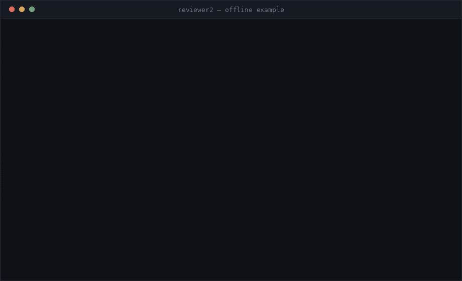

<div align="center">


# Reviewer2

### AI Technical Content Reviewer

*An independent second reviewer for the technical explanations in your videos.*

**[🇧🇷 Leia em português](README.pt-BR.md)**



<sub>The ready-to-run example in <code>examples/</code>, start to finish: no model, no network, no file leaving the machine.</sub>

</div>

---

## Stack

<div align="center">


</div>

| Layer | Technology | Role |
|---|---|---|
| 🎬 **Audio/video** | FFmpeg | audio track extraction and normalisation |
| 🎙️ **Transcription** | faster-whisper | local ASR with timestamps and per-segment confidence |
| 🧠 **LLM** | Ollama · llama.cpp · any OpenAI-compatible API | claim extraction and critical analysis |
| 🔤 **Embeddings** | Sentence Transformers (multilingual) | semantic search, including across languages |
| 🗂️ **Vector store** | FAISS (NumPy as fallback) | evidence retrieval |
| 📄 **Documents** | PyMuPDF · pypdf · python-docx · BeautifulSoup | PDF, DOCX, HTML, Markdown, TXT, URLs |
| ✅ **Validation** | Pydantic | end-to-end data contracts |
| 🌐 **Web interface** | FastAPI · Uvicorn | upload and progress in the browser |
| 🧪 **Tests** | pytest | 196 tests, offline, ~20 s |

Everything runs **locally and for free**. No paid API is required and no file leaves your
machine.

---

## What Reviewer2 is

You record a lecture. Is it technically correct? Where exactly did you oversimplify,
generalise without support, or state something your own bibliography contradicts?

Reviewer2 answers that. You give it **a video** and **one or more reference documents**; it
transcribes the speech, extracts the technical claims you made, retrieves evidence from your
material, and audits the explanation claim by claim.

The report opens with an actionable verdict:

| Verdict | Meaning |
|---|---|
| ✅ `PODE_PUBLICAR` | no technical error supported by evidence |
| 🟡 `AJUSTES_MENORES` | no serious errors; consider rewording or noting them |
| 🟠 `PRECISA_CORRECAO` | claims that could cause incorrect understanding |
| 🔴 `REGRAVAR_TRECHO` | an error that compromises the explanation |

### What it detects

| | |
|---|---|
| technical errors | partially correct statements |
| imprecise formulations | internal contradictions within the video |
| contradictions with the sources | relevant omissions |
| undue generalisations | causality that was not demonstrated |
| incorrect definitions | pedagogical simplifications |

### Why its findings can be trusted

**A fabricated citation is structurally impossible.** The model never writes a quote: it
points at the identifier of a sentence it was given, and the text is taken from the source.
An identifier that does not exist is discarded before it reaches the report.

**Every critique faces a devil's advocate.** A second pass attacks each finding with seven
questions — is there an alternative reading? does the source really support this? could the
transcription have created the problem? A critique the source does not back is removed.

**Confidence is calibrated, not copied from the model.** The printed value combines the
declared confidence with transcription quality, retrieval scores and agreement between
sources. A verdict without a verified quote never appears as high confidence.

**Uncertainty is a valid result.** When your sources do not cover a point, it says so — and
that count is kept **separate** from errors, because it is a limit of your reference
material, not a mistake of yours.

### Measured, not promised

A real run over the repository's example with `qwen2.5:7b-instruct`, scored against a human
annotation by `reviewer2-eval`:

| Metric | Result |
|---|---|
| Critique precision | **83.3%** |
| False positive rate | **0%** |
| Evidence coverage | **100%** |
| Claim extraction recall | **85.7%** |
| Retrieval quality | **100%** |

> One example video is not a benchmark. Measure on *your* material with `reviewer2-eval` —
> the project ships the tool precisely for that.

---

## How to install

### 1. Requirements

* Python 3.10+
* [FFmpeg](https://ffmpeg.org/) on `PATH`
* [Ollama](https://ollama.com/) (or llama.cpp) for the language model

### 2. Install the project

```bash
git clone <your-repository> reviewer2
cd reviewer2

python -m venv .venv
source .venv/bin/activate          # Windows: .venv\Scripts\activate
```

On a machine **without a GPU**, install the CPU build of PyTorch **first** — it avoids
pulling ~3 GB of useless CUDA libraries:

```bash
pip install --index-url https://download.pytorch.org/whl/cpu torch
```

Then:

```bash
pip install -r requirements.txt    # everything
pip install -e .                   # provides the reviewer2* commands
```

Minimal install (core only; enough for Ollama and the `--offline` mode):

```bash
pip install -r requirements-minimal.txt
```

### 3. Install the model

```bash
# Ollama install: https://ollama.com/download
ollama serve                       # usually already runs as a service
ollama pull qwen2.5:7b-instruct    # ~4.7 GB, once
```

| Model | Download | RAM during a review | Quality |
|---|---|---|---|
| `qwen2.5:3b-instruct` | ~2 GB | ~4 GB | basic |
| `qwen2.5:7b-instruct` | ~4.7 GB | ~7 GB | **recommended** |
| `qwen2.5:14b-instruct` | ~9 GB | ~12 GB | better |

The model occupies RAM only **during** the review. Ollama unloads it after 5 idle minutes;
`ollama stop qwen2.5:7b-instruct` frees it immediately.

### 4. Verify the installation

```bash
reviewer2 --check
```

Checks FFmpeg, dependencies, the model server, RAM and disk, and says exactly what to do
about anything missing.

```
  ✓ Python                             3.13.15
  ✓ FFmpeg                             /usr/bin/ffmpeg
  ✓ faster-whisper                     transcrição de áudio
  ✓ LLM (ollama/qwen2.5:7b-instruct)   respondendo em http://localhost:11434
  ✓ Memória                            24 GB no total · o modelo precisa de ~7 GB

  Tudo pronto para revisar.
```

The Whisper and embedding models download themselves on first use.

---

## How to use

### Command line

```bash
reviewer2 --video lecture.mp4 --reference paper.pdf
```

Produces three files:

```text
data/reports/lecture_review.md             # the report
data/reports/lecture_review_audit.json     # every critique with its evidence chain
data/reports/lecture_review_retrieval.json # every query, chunk and similarity score
```

### More examples

```bash
# several references: files, a whole directory and a URL
reviewer2 --video lecture.mp4 \
          --reference paper.pdf \
          --reference notes.md \
          --reference bibliography/ \
          --reference https://en.wikipedia.org/wiki/CPU_cache

# reuse an existing transcript (skips the ASR stage)
reviewer2 --transcript data/transcripts/lecture.json --reference paper.pdf

# report in Portuguese
reviewer2 --video lecture.mp4 --reference paper.pdf --report-language pt

# dry run with no model at all — see the output format in seconds
reviewer2 --transcript examples/aula_transcricao.json \
          --reference examples/referencia_arquitetura.md --offline
```

### Web interface

```bash
pip install 'reviewer2[api]'
reviewer2-web                      # http://127.0.0.1:8000
```

Upload the video and references in the browser, follow the six pipeline stages, and read or
download the report on the page. Binds to `localhost` only by default; use
`--host 0.0.0.0 --port 8080` to expose it on the network.

### Measure the review quality

```bash
reviewer2-eval --report data/reports/lecture_review_audit.json \
               --gold examples/gold_standard.json
```

Annotate one of your own videos (format in `examples/gold_standard.json`) and see the real
precision of the model you chose. That is how you decide whether to change models — with a
number, not an impression.

### Anatomy of the report

Each claim becomes a full chain: **critique → claim → timestamp → evidence → source page →
reasoning**.

```markdown
### Claim #003

**Timestamp:** 00:00:26

**Afirmação:**
> "A memória cache é uma memória não volátil que fica dentro do processador."

**Classificação:** `INCORRETA`   **Gravidade:** `CRITICO`   **Confiança:** `ALTA` (0.78)

**Evidência:**
Fonte: `arquitetura.pdf` · Página: 12 · Similaridade: 0.81
> "A memória cache é uma memória volátil construída com células SRAM."

**Análise:** the source states the opposite explicitly: cache is volatile.

**Correção sugerida:**
> "A memória cache é uma memória volátil que fica dentro do processador."
```

### Useful flags

| Flag | Meaning |
|---|---|
| `--check` | verify the environment and exit |
| `--offline` | no LLM and no download: heuristic engine (dry run) |
| `--llm-model` | change the model, e.g. `qwen2.5:14b-instruct` |
| `--llm-provider` | `ollama` (default), `llamacpp`, `openai-compatible`, `heuristic` |
| `--llm-url` | base URL of the model server |
| `--whisper-model` | `tiny` … `large-v3` |
| `--top-k`, `--min-score` | retrieval breadth and the evidence threshold |
| `--no-verification` | skip the devil's advocate (faster, less precise) |
| `--no-omissions`, `--no-contradictions` | skip those analyses |
| `--force-transcription`, `--rebuild-index` | ignore the caches |
| `--report-language` | `pt` or `en` |
| `--print-config` | show the effective configuration and exit |

---

## Configuration

Configuration lives outside the code, in `config.yaml` and `.env` (copy `.env.example`).

**Precedence:** CLI › environment › `config.yaml` › defaults.

```bash
export REVIEWER2_LLM__MODEL=llama3.1:8b       # REVIEWER2_ prefix, __ for nesting
export REVIEWER2_RETRIEVAL__TOP_K=8
```

### Main keys

```yaml
llm:
  provider: ollama          # ollama | llamacpp | openai-compatible | heuristic
  model: qwen2.5:7b-instruct
  base_url: http://localhost:11434
  temperature: 0.1          # low: this is an audit, not creative writing
  num_ctx: 8192             # context window; the main RAM driver after the model
  max_tokens: 3072
  concurrency: 2            # simultaneous calls (see Performance)
  fallback_to_heuristic: false   # false = fail loudly, never a fake review

retrieval:
  top_k: 6                  # chunks retrieved per claim
  min_score: 0.25           # below this the claim is NAO_SUSTENTADA
  backend: auto             # auto | faiss | numpy

analysis:
  cache_critiques: true     # reuse critiques across runs
  max_contradiction_pairs: 10    # every compared pair is one model call
  detect_omissions: true

verification:
  enabled: true             # the devil's advocate
  drop_unsustained: true    # remove a critique the source does not back

transcription:
  model: small              # tiny | base | small | medium | large-v3
  language: null            # null = auto-detect
```

### Swapping the LLM

The whole system talks only to the `LLMProvider` interface, so the backend is chosen by
configuration, without touching the analysis code.

```yaml
# Ollama (default)
llm: { provider: ollama, model: qwen2.5:7b-instruct, base_url: "http://localhost:11434" }

# llama.cpp, LM Studio, vLLM — any OpenAI-compatible server
llm: { provider: llamacpp, model: local-model, base_url: "http://localhost:8080" }

# A cloud endpoint (uses none of your RAM; your files do leave the machine)
llm: { provider: openai-compatible, model: llama-3.1-8b-instant,
       base_url: "https://api.groq.com/openai", api_key: null }
```

To add a new provider, implement `generate()` and register it in `build_llm()`:

```python
class LLMProvider(abc.ABC):
    @abc.abstractmethod
    def generate(self, prompt: str, *, system=None, temperature=None,
                 max_tokens=None, stop=None) -> str: ...
```

### Performance

Time is dominated by the model's token generation — on CPU, **~47 s per call** with
`qwen2.5:7b-instruct` (6.3 tok/s), of which ~85% is generation and only ~15% reading the
prompt. Three settings ship enabled:

| Setting | Measured effect |
|---|---|
| `llm.concurrency: 2` | 2 simultaneous calls give **2.7×** the throughput of 1; 3 is slower |
| `llm.cache: true` | **measured: 2060 s → 28 s** when repeating a review; an interrupted run resumes |
| `max_contradiction_pairs: 10` | every compared pair is one call |

A 10-minute video (~40 claims) produces about **77 calls**, roughly **50–60 minutes** on
the first run. Re-running afterwards costs seconds.

**Do not trade down to a smaller model for speed.** Measured comparison in this project:

| | `qwen2.5:7b-instruct` | `qwen2.5:3b-instruct` |
|---|---|---|
| Latency per call | 47.3 s | 26.2 s (1.8× faster) |
| **Problems found** (video with 5 real errors) | **6** | **0** |
| Evidence coverage | 100% | 0% |
| Calibration error | 0.220 | 0.533 |

The 3B extracts and retrieves well, but cannot hold the devil's advocate reasoning: it
drops 6 of 7 critiques and returns an empty report. Half the time for zero errors found
is not a saving.

---

## Architecture

### The data path

```text
        VIDEO                            REFERENCES (PDF · DOCX · MD · HTML · URL)
          │                                       │
          ▼                                       ▼
   ffmpeg: extract audio             parsing (page and section preserved)
          │                                       │
          ▼                                       ▼
   faster-whisper                          overlapping chunking
   timestamps + confidence                       │
          │                                       ▼
          ▼                                Sentence Transformers
   semantic windows                               │
          │                                       ▼
          ▼                                FAISS · vector store
   claim extraction (LLM) ────────────────────────┤
          │                                       │
          ▼                                       ▼
   per claim: retrieval ────────────────► evidence + scores + provenance
          │
          ▼
   evidence-bound critique (LLM)
          │   ├── citation by sentence identifier
          │   ├── omissions in the same answer
          │   └── internal contradictions of the video
          ▼
   devil's advocate — adversarial second pass
          │
          ▼
   confidence calibration
          │
          ▼
   Markdown report + audit JSON + retrieval trace
```

### Code structure

```text
reviewer2/
├── app/
│   ├── transcription/   ffmpeg + faster-whisper
│   │   ├── audio.py         audio extraction and normalisation
│   │   ├── whisper.py       ASR, timestamps, per-segment confidence
│   │   └── models.py        transcript serialisation
│   ├── documents/       reference ingestion
│   │   ├── loader.py        files, directories and URLs
│   │   ├── parser.py        PDF, TXT, Markdown, DOCX, HTML
│   │   └── chunker.py       chunking with page and section preserved
│   ├── embeddings/      Sentence Transformers + hashing fallback
│   ├── retrieval/       FAISS / NumPy + retriever with an auditable trace
│   ├── llm/             abstract interface + Ollama, llama.cpp, heuristic
│   ├── analysis/        the core of the audit
│   │   ├── claims.py          transcript → analysable claims
│   │   ├── critique.py        RAG + evidence-bound judgement
│   │   ├── contradictions.py  internal contradictions of the video
│   │   ├── omissions.py       source conditions missing from the video
│   │   ├── confidence.py      confidence calibration
│   │   └── cache.py           reuse across runs
│   ├── verification/    devil's advocate
│   ├── metrics/         evaluation harness (precision, false positives, calibration)
│   ├── reports/         Markdown generator (pt/en)
│   ├── web/             FastAPI interface (job queue + single page)
│   ├── prompts/         every prompt, with the anti-hallucination policy
│   ├── doctor.py        environment check (--check)
│   ├── pipeline.py      stage orchestration
│   └── main.py          CLI
├── data/                videos, documents, transcripts, reports (git-ignored)
├── examples/            sample transcript, reference and gold standard
└── tests/               196 tests: unit + end-to-end integration
```

### Swappable layers

Each layer sits behind an interface, so the backend is chosen by configuration:

| Layer | Interface | Implementations |
|---|---|---|
| LLM | `LLMProvider` | Ollama · llama.cpp / OpenAI-compatible · offline heuristic |
| Embeddings | `EmbeddingModel` | Sentence Transformers · deterministic hashing |
| Vector store | `VectorStore` | FAISS · NumPy (exact brute force) |

When an optional dependency is missing, the system degrades to the available alternative and
**records that in the report**, instead of failing silently.

### Traceability

Each run writes three files: the report, a `*_audit.json` with every critique and its
evidence chain, and a `*_retrieval.json` with every vector-store query, the chunks it
returned and their scores. Any conclusion can be audited back to the query that produced it.

### Tests

```bash
pytest                     # 196 tests, offline, ~20 s
pytest --cov=app           # with coverage
```

They cover transcription, parsing, chunking, embeddings, retrieval, extraction,
classification, contradictions, calibration, verification, reporting, the cache, the HTTP
providers, the metrics and the web interface — plus an integration test asserting that
**no citation in the report exists outside the indexed corpus**.

---

## License

Distributed under the **MIT License**. See [LICENSE](LICENSE) for the full text.

```
Copyright (c) 2026 Gustavo Rech Costa

Permission is hereby granted, free of charge, to any person obtaining a copy
of this software and associated documentation files (the "Software"), to deal
in the Software without restriction, including without limitation the rights
to use, copy, modify, merge, publish, distribute, sublicense, and/or sell
copies of the Software.
```
